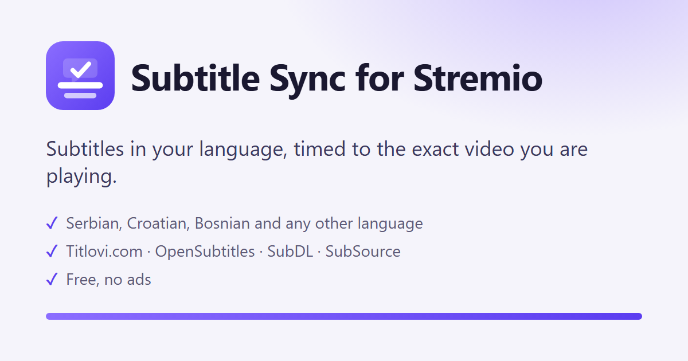
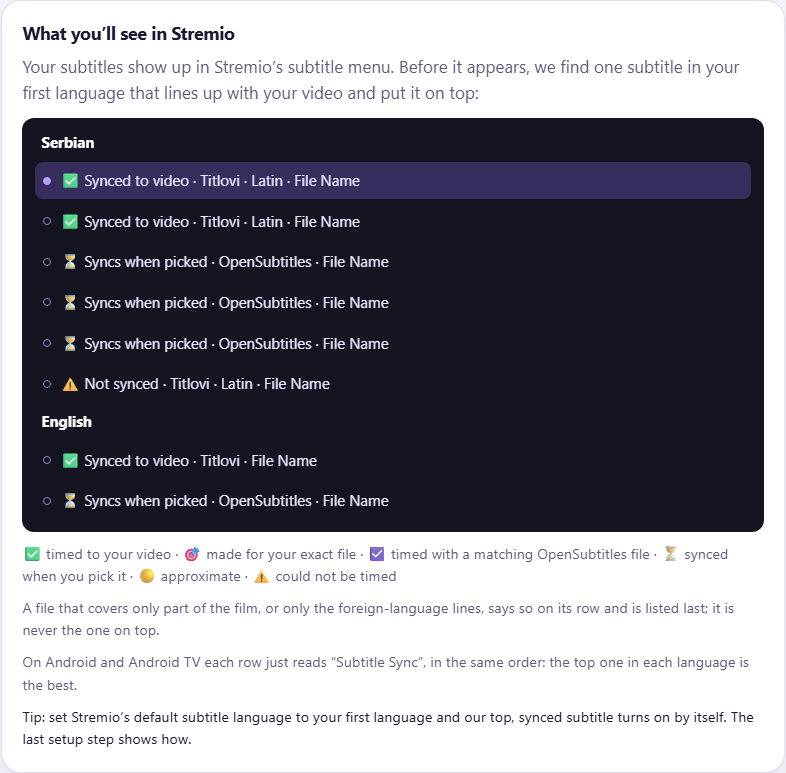
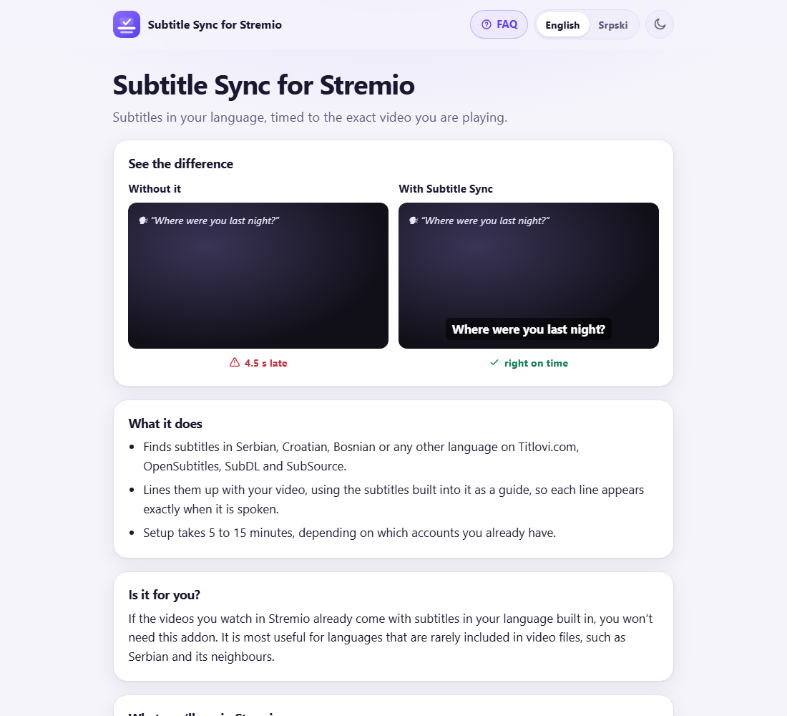

# Subtitle Sync for Stremio

**Subtitles in your language, timed to the exact video you are playing.**

Subtitle Sync for Stremio is a free Stremio addon. It finds subtitles in Serbian, Croatian,
Bosnian or any other language on Titlovi.com, OpenSubtitles, SubDL and SubSource, and lines
them up with the exact video you are playing, before the subtitle menu opens. The one that
lines up goes on top of the menu.

**Set it up: https://subtitlesync.stream** (English) · **https://subtitlesync.stream/sr/** (srpski)

This repository holds the addon's documentation, pictures and list of changes. The addon runs
at the address above; there is nothing to install from here.

## Why subtitles run early or late

A subtitle's times were measured on one particular video file. Yours can start at a different
moment (another logo, a recap), play at another speed (25 or 23.976 frames per second: 2 min
34 s off after an hour), or be a different cut. Stremio's own subtitle delay moves every line
by the same amount, so it fixes only the first case.
More: [Stremio subtitles out of sync? Why it happens and how to fix it](https://subtitlesync.stream/stremio-subtitles-out-of-sync).

## What it does

1. Looks for subtitles in your languages on OpenSubtitles, which every install has, and on
   Titlovi.com, SubDL and SubSource if you add them, each with your own account or key.
2. Takes a timing reference for your copy of the film or episode.
3. Compares each subtitle's dialogue with it and re-times it: a fixed gap, a different speed,
   or a different cut.
4. Shows in Stremio's subtitle menu how each subtitle was timed, so you know what you pick.

| Where your video is | What the timing is lined up with |
|---|---|
| TorBox | The video itself: its own subtitle track, read through the stream addon you already use, when the file has one. Otherwise as below. |
| Real-Debrid, AllDebrid, Premiumize, Debrid-Link | These services forbid using your account from a server or from two places at once, so this addon never reads your file there. Your subtitles are lined up using OpenSubtitles instead, which works for most popular films. |
| No debrid service | OpenSubtitles, as above. |

## What it does not do

- It never hosts or links videos. It handles subtitles only.
- It does not translate subtitles. It finds ones people wrote in your language and fixes their timing.
- It cannot re-time a subtitle when there is nothing to compare it with; the menu then says so.
- It cannot help in an app that tells subtitle addons nothing about the video file (no name, size or fingerprint). Stremio sends them on every device and Nuvio sends the fingerprint; in an app that sends nothing, every subtitle comes untimed and the list says so. Only that app's developers can change it.

## Setting it up

Setup takes about five minutes on a guided page, in English or Serbian:

1. Pick your subtitle languages, in order.
2. Add your OpenSubtitles account: its API key, username and password (required, free).
   Optionally add Titlovi.com (paid: a yearly supporter donation to Titlovi.com), SubDL or
   SubSource (free, each with its own key).
3. Say whether you use a debrid service. With TorBox, paste your TorBox API key (the
   simplest way: the addon then finds your video in your own TorBox account, whichever
   stream addon you play from); your stream addon's link works too and is optional.
4. Install in Stremio with one click (or copy the link).
5. Set Stremio's default subtitle language, so the top subtitle turns on by itself.

## Questions and help

- Frequently asked questions and a contact form: https://subtitlesync.stream/help
- What changed and when: [CHANGELOG.md](CHANGELOG.md) · https://subtitlesync.stream/changelog

## Support

The addon is free and has no ads. Its server runs on donations: https://ko-fi.com/antebellum

---

Subtitle Sync for Stremio is an independent project. It is not made by or connected to
Stremio, Titlovi.com, OpenSubtitles, SubDL, SubSource or any stream addon.
